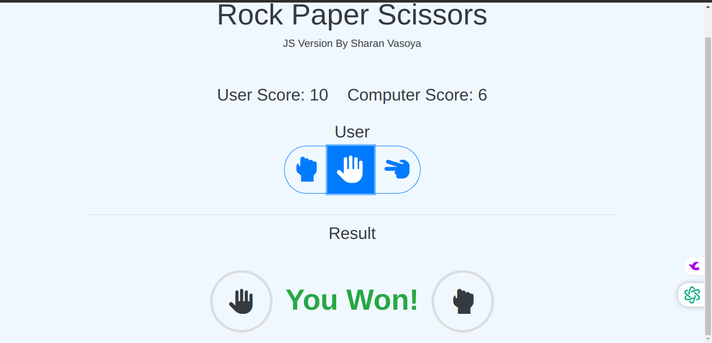

# Rock Paper Scissors Game

## Description

This is a simple Rock Paper Scissors game implemented using HTML, CSS, and JavaScript. The game allows the user to play against the computer and keeps track of the scores. Sound effects enhance the user experience, making the game more engaging and fun.

## Features

- Play Rock Paper Scissors against the computer
- Keeps track of user and computer scores
- Sound effects for win, lose, and draw scenarios
- Modern and responsive design

## Technologies Used

- HTML
- CSS (Bootstrap for styling)
- JavaScript
- Font Awesome for icons

## Installation

To run this project locally, follow these steps:

1. Clone the repository or download the ZIP file.
    ```bash
    git clone https://vasoyasharan.github.io/JS-Stone-Paper-Scissors/
    ```
2. Navigate to the project directory.
    ```bash
    cd rock-paper-scissors
    ```
3. Open `index.html` in your web browser.

## Usage

1. Open `index.html` in your web browser.
2. Click on one of the buttons (Rock, Paper, or Scissors) to make your move.
3. The computer will randomly choose its move.
4. The result will be displayed, and the scores will be updated accordingly.
5. Enjoy the sound effects when you win, lose, or draw!

## Screenshots



## Contributing

If you want to contribute to this project, please fork the repository and submit a pull request. We welcome any improvements and suggestions.

## License

This project is licensed under the MIT License

## Acknowledgements

- [Freesound](https://freesound.org/) for providing free sound effects.
- [Font Awesome](https://fontawesome.com/) for the amazing icons.
- [Bootstrap](https://getbootstrap.com/) for the responsive design framework.
