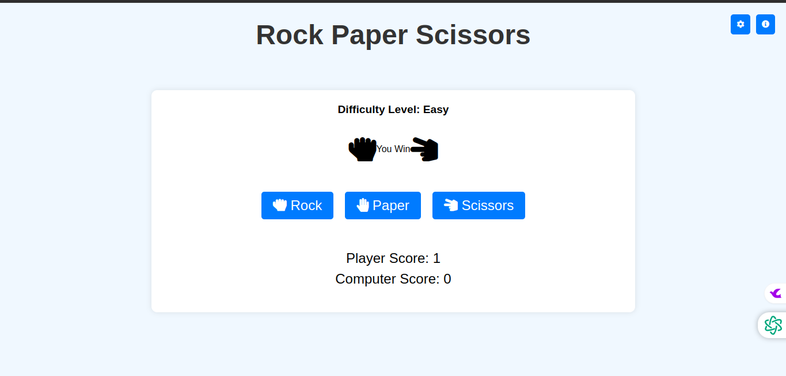
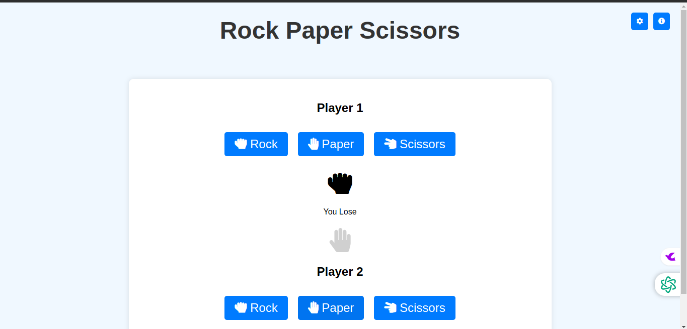

# Rock Paper Scissors Game

## Description

This is a simple Rock Paper Scissors game implemented using HTML, CSS, and JavaScript. The game allows the user to play against the computer or against another player in multiplayer mode. It keeps track of scores and uses sound effects to enhance the gaming experience.

## Features

- **Single Player Mode**: Play against the computer and track scores.
- **Multiplayer Mode**: Compete against another player on the same device.
- **Score Tracking**: Keeps a record of user and computer (or player 2) scores.
- **Sound Effects**: Enhances gameplay with win, lose, and draw sound effects.
- **Modern and Responsive Design**: Designed using Bootstrap for a responsive layout.

## Technologies Used

- **HTML**: Structuring the game interface.
- **CSS (Bootstrap)**: Styling for a modern look and responsiveness.
- **JavaScript**: Implementing game logic and interaction.
- **Font Awesome**: Icons for visual elements such as hands (rock, paper, scissors).
- **Freesound**: Source of free sound effects used in the game.
- **Git**: Version control for project management.

## Live Demo

You can try the live demo of the game [here](https://vasoyasharan.github.io/JS-Stone-Paper-Scissors/)

## Installation

To run this project locally, follow these steps:

1. Clone the repository or download the ZIP file.

    ```bash
    git clone https://github.com/your-username/rock-paper-scissors.git
    ```

2. Navigate to the project directory.

    ```bash
    cd rock-paper-scissors
    ```

3. Open `index.html` in your web browser.

## Usage

1. Open `index.html` in your web browser.
2. Select the game mode (Single Player or Multiplayer).
3. Follow on-screen instructions to play:
   - In **Single Player Mode**, click on buttons to make your move against the computer.
   - In **Multiplayer Mode**, players take turns making moves against each other on the same screen.
4. Results will be displayed after each round, updating scores accordingly.
5. Enjoy the sound effects that accompany win, lose, or draw outcomes!

## Screenshots

### Single Player Game



### Multiplayer Game



## Contributing

If you'd like to contribute to this project, please fork the repository and submit a pull request with your changes. We welcome any improvements or feature additions!

## License

This project is licensed under the MIT License - see the [LICENSE](LICENSE) file for details.

## Acknowledgements

- **Freesound**: Providing free sound effects used in the game.
- **Font Awesome**: Supplying icons used for visual elements.
- **Bootstrap**: Framework for responsive design.
